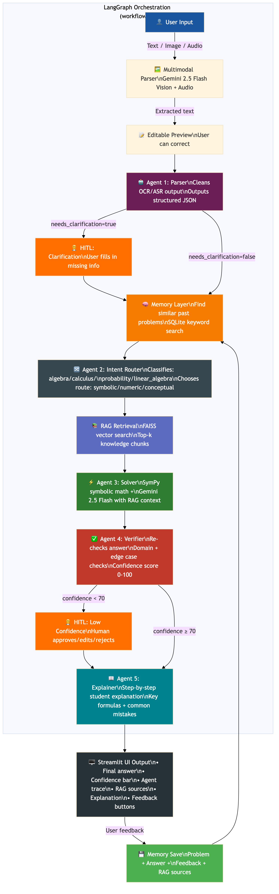
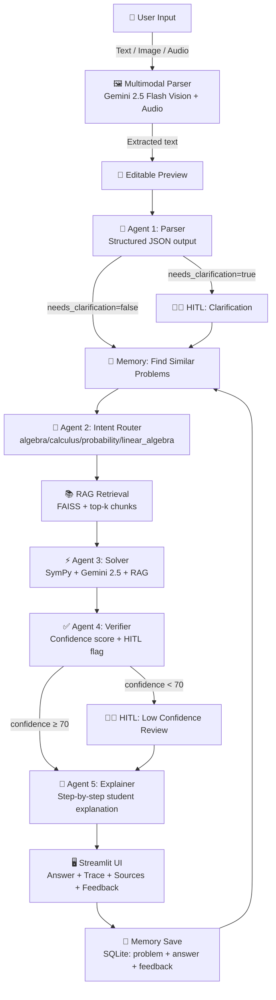

# 🧮 Multimodal Math Mentor

> A JEE-level AI math tutor powered by Google Gemini with RAG, 5 Agents, Human-in-the-Loop, and Memory.



## Live Demo
🔗 **[https://your-app.streamlit.app](https://your-app.streamlit.app)** *(replace after deployment)*

## Demo Video
🎬 **[Watch 4-min demo](https://loom.com/your-video)** *(replace after recording)*

---

## Architecture



---

## Features

| Feature | Implementation |
|---------|---------------|
| **Image input** | Google Gemini 2.5 Flash Vision — handles handwritten + printed |
| **Audio input** | Audio transcription (Whisper fallback if needed) |
| **Text input** | Direct input with instant parsing |
| **5 Agents** | Parser → Router → Solver → Verifier → Explainer |
| **RAG** | FAISS vector store with Gemini embeddings, 12 knowledge base docs |
| **HITL** | Triggers on low OCR confidence, ambiguity, or confidence < 70% |
| **Memory** | SQLite — stores all problems, answers, and feedback |
| **Symbolic math** | SymPy for algebraic / calculus problems |
| **UI** | Streamlit with agent trace, RAG panel, confidence bar, feedback |
| **Model** | Gemini 2.5 Flash - Latest and fastest model |

---

## Setup & Run

### 1. Clone
```bash
git clone https://github.com/yourusername/math-mentor
cd math-mentor
```

### 2. Install dependencies
```bash
python -m venv venv
source venv/bin/activate  # Windows: venv\Scripts\activate
cl
```

### 3. Set API key
```bash
cp .env.example .env
# Edit .env and add: GEMINI_API_KEY=your-gemini-api-key-here
```

### 4. Run
```bash
streamlit run app.py
```

Then open **http://localhost:8501** in your browser.

### 5. Build RAG index (optional but recommended)
In the app sidebar, click **"Build RAG Index"** after entering your API key.
Without this, the app uses keyword search (still works, but less accurate).

---

## Project Structure

```
math-mentor/
├── app.py                  # Streamlit UI (all UI code)
├── orchestration/          # LangGraph orchestration (workflow.py)
├── agents/                 # All 5 agents package (client, parser, solver, etc.)
├── rag/                    # RAG package (chunking, embedding, index_build, retrieve)
├── memory/                 # Memory layer package (SQLite, retrieval, save)
├── knowledge_base/         # 12 curated math knowledge docs
│   ├── algebra_quadratic.txt
│   ├── algebra_sequences.txt
│   ├── algebra_complex_functions.txt
│   ├── probability_basics.txt
│   ├── probability_distributions.txt
│   ├── calculus_limits.txt
│   ├── calculus_derivatives.txt
│   ├── calculus_integration.txt
│   ├── calculus_optimization.txt
│   ├── linear_algebra_basics.txt
│   ├── common_mistakes.txt
│   └── solution_templates.txt
├── requirements.txt
├── .env.example
├── architecture.mmd        # Mermaid diagram
└── README.md
```

---

## Deployment (Streamlit Cloud)

1. Push to GitHub
2. Go to [share.streamlit.io](https://share.streamlit.io) → New app
3. Select repo, branch: `main`, file: `app.py`
4. In **Settings → Secrets**, add:
   ```
   GEMINI_API_KEY = "your-gemini-api-key-here"
   ```
5. Click **Deploy** → get your live link in ~3 minutes

---

## Deliverables Checklist

- [x] Multimodal input: image (Gemini 2.5 Flash Vision), audio (transcription), text
- [x] Parser Agent — structured JSON output with needs_clarification flag
- [x] RAG pipeline — FAISS vector store with Gemini embeddings, top-k retrieval, sources shown in UI
- [x] 5 agents — Parser, Router, Solver (SymPy + Gemini 2.5), Verifier, Explainer
- [x] Streamlit UI — input selector, extraction preview, agent trace, context panel, feedback
- [x] HITL — triggers on low confidence, ambiguity, low OCR confidence
- [x] Memory — SQLite, saves all problems + feedback, retrieves similar at runtime
- [x] Latest Model — Using Gemini 2.5 Flash (fastest and most capable)
- [x] GitHub repo with README + architecture diagram + .env.example
- [ ] Demo video (record after deployment)

---

## Scope of Math Supported
- **Algebra** — quadratic equations, sequences, complex numbers, functions
- **Probability** — basic rules, Bayes, distributions (binomial, Poisson)
- **Calculus** — limits, derivatives, integration, optimization
- **Linear Algebra** — matrices, determinants, eigenvalues, systems
